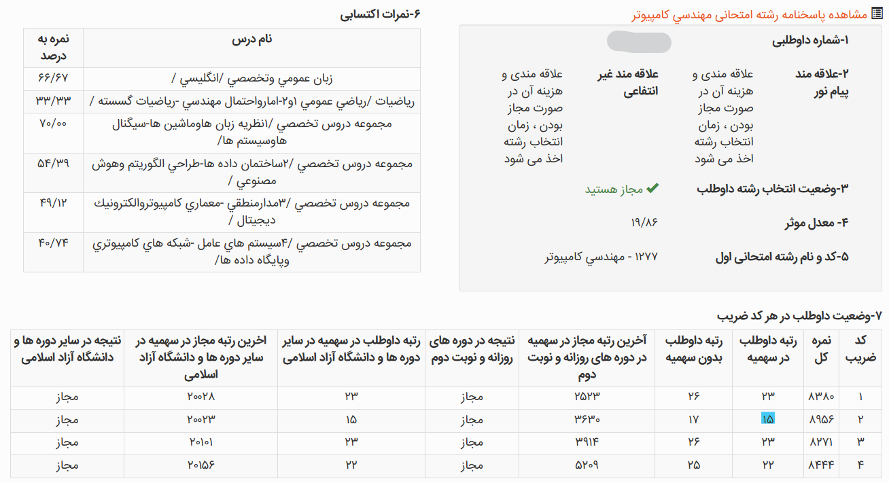

# تجربه من از مسیر کنکور ارشد

### معرفی

سلام!

خوشحالم که دارید این متن رو می‌خونید و امیدوارم تجربه‌ای که اینجا می‌نویسم بتونه براتون مفید باشه.

من امیررضا آذری هستم، ورودی ۹۹ مهندسی کامپیوتر دانشگاه صنعتی شریف و در سال ۱۴۰۴ از این رشته فارغ‌التحصیل شدم. در کنکور کارشناسی ارشد سال ۱۴۰۵ هم **رتبه ۱۵ هوش مصنوعی** رو به دست آوردم.

دوران کارشناسی برای من مسیر کاملاً خطی و بدون فراز و نشیبی نبود. درس‌های سخت زیادی رو گذروندم، بیشتر از ۲۰ تجربه دستیاری در درس‌های مختلف داشتم و در کنار دانشگاه، تجربه‌های کاری و پژوهشی مختلفی هم به دست آوردم. از طرفی، از همون سال‌های کارشناسی به هوش مصنوعی و حوزه‌های مرتبط باهاش علاقه‌مند شدم.

اگر دوست داشتید بیشتر با مسیر تحصیلی و کاری من آشنا بشید، می‌تونید [اینجا](https://amirreza81.github.io/) رو ببینید :).

اما چیزی که قراره در این نوشته درباره‌ش صحبت کنم، خودِ مسیر کنکور ارشده؛ از زمانی که تصمیم گرفتم کنکور بدم و شروع کردم، تا انتخاب منابع، برنامه‌ریزی، تست‌زدن، ماه‌های پایانی و در نهایت روز کنکور.

سعی می‌کنم تجربه‌ام رو تا جای ممکن صادقانه و بدون اینکه بخوام یک نسخه واحد برای همه بپیچم بنویسم؛ هم چیزهایی که برام جواب داد، هم اشتباهاتی که کردم و اگر برگردم به عقب، احتمالاً متفاوت انجامشون می‌دم.

### کارنامه اعمال

همین ابتدای کار، کارنامه‌ام رو براتون قرار می‌دم تا بتونید رتبه و درصدهای دروسم رو ببینید؛ در ادامه هم به توضیح مفصل مسیر و نحوه‌ی مطالعه‌ام خواهم پرداخت :).

### چی شد که تصمیم گرفتم کنکور بدم؟

منم مثل خیلی از دوستام، از سال آخر کارشناسی که می‌شد ۱۴۰۳، تصمیم به مهاجرت تحصیلی گرفتم. دو تا ادمیشن گرفتم که یکی‌شون متأسفانه ویزام نیومد و برای اون یکی هم به دلایلی تصمیم گرفتم اقدام نکنم.

تصمیم گرفتم سال ۱۴۰۴ دوباره شانسم رو امتحان کنم. حدود یکی دو ماه، یعنی مهر و آبان، همچنان مشغول اپلای بودم؛ ولی با توجه به شرایط کشور، وضعیت چندان جالبی نداشتم.

وقتی به دی ماه رسیدیم، به‌خاطر مشکلاتی که توی کشور پیش اومد و قطعی اینترنت، شانس اپلای برای من عملاً خیلی پایین اومده بود. همون‌جا بود که تصمیم گرفتم برم سراغ کنکور ارشد و سعی کنم ارشدم رو مجدداً در دانشگاه خودم ادامه بدم؛ هم برای اینکه مسیر تحصیلی‌ام رو ادامه بدم و شانس اپلای برای دکتری رو بعد از ارشد همچنان داشته باشم، و هم اینکه با مشکل سربازی مواجه نشم.

بنابراین، به‌طور خلاصه، بعد از حدود دو سال تلاش ناموفق برای اپلای، ناچار شدم مسیرم رو عوض کنم و شروع کنم به خوندن برای کنکور ارشد.

### وقتی شروع کردم، شرایط من چطور بود؟

شاید فکر کنید من از همون دی شروع به خوندن کردم، اما خیر! :)

اون زمان مشغول کار بودم و واقعاً حوصله‌ی خوندن برای ارشد رو هم نداشتم. مدام شروع کردن رو عقب می‌انداختم و با خودم فکر می‌کردم «از بهمن هم شروع کنم، تا اردیبهشت می‌رسم جمعش کنم!» که خب... اصلاً این‌طوری نبود.

اواخر بهمن بود که بالاخره شروع کردم. بدون مشاوره و بدون اینکه از کسی سوال خاصی بپرسم، شروع کردم به خوندن ساختمان داده و هوش مصنوعی. پایه‌ام به‌طور کلی متوسط بود؛ توی بعضی درس‌ها خیلی قوی بودم و توی بعضی درس‌ها هم واقعاً ضعیف. در بخش مربوط به درس‌ها، بیشتر درباره‌ی این موضوع توضیح می‌دم.

تقریباً دو هفته همین‌طوری مشغول مطالعه بودم که بوممم! جنگ شد و همه‌چیز به هم ریخت.

از تهران خارج شدم و توی آرامش شهرستان تصمیم گرفتم این بار کاملاً جدی شروع کنم. از همون روزهای اول، روزی حدود ۷ تا ۸ ساعت مطالعه داشتم و اینجا بود که مسیر کنکور برای من واقعاً شروع شد.
دقت کنید در این زمان کنکور قرار بود وسط اردیبهشت برگزار بشه.

### مشاور داشتم؟ تله بزرگ و ترسناک!

خودم حس می‌کردم به مشاور و حرف‌های یه نفر کنارم نیاز دارم. اول کار، یه مقدار گول یه مؤسسه رو خوردم و یه تایم مشاوره‌ی ۲۰ دقیقه‌ای گرفتم که ببینم اصلاً چه خبره و دنیا دست کیه.

چشمتون روز بد نبینه! :)

دقیقه‌ی اول جلسه‌مون این‌طوری شروع شد:

«کدوم پکیجو داری؟»

:))))

گفتم: «چی؟»

گفت: «پکیج دیگه.»

یعنی عملاً از همون اول می‌خواست به من این حس رو بده که چون پکیج ندارم، یه چیزی رو از دست دادم یا از بقیه عقبم. :)

یه مقدار توضیح داد که پولش حلال بشه و گفت چه چیزهایی بخونم و اینا. آخر جلسه هم یه منتی سرم گذاشت که «آره، چون شریفی‌ای، به پشتیبانی پیام بده، با تخفیف پکیج کل دروس رو بگیر و رتبه یک شو!» :))))

هیچی، برای من کاملاً مشخص بود که بیشتر از اینکه مشاور باشه، بیزنس‌منه.

همون‌جا خواستم این تله رو بهتون بگم که خیلییی حواستون باشه. :)))
یه زمانی بازار کنکور دست بعضی مجموعه‌ها بود و به نظرم باید خیلی مراقب باشید که صرفاً با تبلیغات و فروش پکیج، بهتون القا نکنن که بدون خرید اون‌ها نمی‌تونید نتیجه بگیرید.

بعد از این تجربه، از بچه‌های خود شریف یه مقدار پرس‌وجو کردم و یه مشاوره‌ی کوتاه تلگرامی هم با آقای فرج‌تبریزی داشتم. مشاوره‌ی ایشون کمک کرد مسیر کلی برام خیلی شفاف‌تر بشه و بفهمم چه اشتباهاتی تا اون موقع داشتم. توی بخش «اشتباهاتم» می‌تونید مفصل‌تر درباره‌شون بخونید.

این ماجرا هنوز قبل از جنگ بود. بعد از اون، دیگه مسیر برام مشخص شده بود؛ خط رو سفت گرفتم و تا آخرش رفتم.

### آشنایی با cshub و منتورینگ

از طریق یکی از بچه‌های شریف که سال قبل کنکور داده بود، اسم CSHub رو شنیدم. یکم سرچ کردم و دیدم جالب به نظر میاد. آزمون ۱۳ مرحله‌ای‌شون رو همون اسفند ثبت‌نام کردم.

البته داستان از این قراره که وقتی استارت جدی کنکور رو زدم، تازه آزمون اولش رو دقیقاً روز قبل از اولین آزمون جامع دادم! :))))

رتبه‌ام توی آزمون اول 2 شد و همین خیلی امیدوارم کرد. فرداش آزمون جامع داشتیم و رتبه‌ام شد ۱۲.

به واسطه‌ی رتبه‌ام در آزمون‌ها و آشنایی‌ای که با آقای خانی پیدا کرده بودم، مستقیماً هم وارد منتورینگ عمومی شدم و هم سطح ۱. آقای خانی هم هر موقع بهشون پیام می‌دادم، کمکم می‌کردن و این برای من واقعاً ارزشمند بود.

یه نکته‌ی بامزه هم اینه که اسمم رو توی آزمون‌ها «رضا جواهری» گذاشته بودم که هویتم مخفی بمونه و استرس زیادی روم نباشه. :)))

**خلاصه، دوستان، رضا جواهری من بودم!**

در مورد CSHub، به نظرم هم گروه منتورینگ عمومی و هم گروه سطح ۱ واقعاً خوب بودن. نکته‌ی اصلی برای من این بود که شما رو توی فضای بچه‌های کنکوری قرار می‌ده و همین موضوع می‌تونه یه استرس مثبت ایجاد کنه. از طرفی، هر سوالی هم داشته باشید، معمولاً کافیه بپرسید؛ بالاخره یکی پیدا می‌شه که جوابش رو بدونه و کمکتون کنه :))).

**در مجموع، برای من ترکیب مشاوره با آقای فرج‌تبریزی، آشنایی با CSHub، نتیجه‌ی آزمون جامع اول و آشنایی با آقای خانی، نقطه‌ی عطف مهمی توی مسیر کنکور بود.**

اگر کنکوری هستید، به نظرم آزمون‌های CSHub رو حتماً توی گزینه‌هاتون در نظر بگیرید و از کنارشون ساده نگذرید.

### منابع رو چطور انتخاب کردم؟

من چون نسبتاً دیر با CSHub آشنا شدم، تا قبل از آشنایی باهاشون بخش زیادی از منابعی که برای کنکور تهیه کرده بودم از مدرسان شریف بود :))))

در واقع انتخاب منابع من هم در طول مسیر عوض شد. اوایل که هنوز CSHub رو نمی‌شناختم، طبیعتاً بر اساس چیزهایی که خودم پیدا کرده بودم و منابعی که در دسترسم بود، بیشتر سراغ کتاب‌های مدرسان شریف رفتم. البته خدایی بعضی از کتاب‌هاشون واقعاً بی‌نظیر بودن و خیلی هم به دردم خوردن.

بعدتر که با CSHub آشنا شدم، برای بعضی از درس‌ها که هنوز منبع مشخصی نداشتم، از منابعی که خودشون معرفی کرده بودن استفاده کردم. مخصوصاً برای یه سری از درس‌هایی که بعد از تعویق کنکور به برنامه‌ام اضافه شدن، دیگه مستقیماً سراغ منابع پیشنهادی CSHub رفتم.

توی بخش بعدی، برای هر درس دقیق و با جزئیات توضیح می‌دم که چه منبعی استفاده کردم، چرا اون منبع رو انتخاب کردم و در نهایت چقدر برام مفید بود.

### برای هر درس چطور مطالعه کردم؟

خب، مرسی که تا اینجا حرف‌هامو خوندید. رسیدیم به مهم‌ترین بخش. اینجا سعی می‌کنم درس‌به‌درس تجربه‌هام، منابعی که استفاده کردم، نحوه‌ی تست‌زدن و کلاً هر چیزی که برای هر درس انجام دادم رو توضیح بدم.

#### زبان انگلیسی

زبانم تقریباً خوب بود و اوایل خیلی نیاز نداشتم براش وقت بذارم. البته توی بخش لغات، یه مقدار هم به شانس بستگی داره که آزمون چطور بیاد.

من حدود یک ماه آخر کنکور، روزی نیم ساعت فایل واژگان کنکورهای اخیر کامپیوتر رو می‌خوندم و واقعاً کمکم کرد. برای گرامر و درک مطلب هم تقریباً تمرین خاصی نداشتم و همون آزمون‌های CSHub برام کافی بود.

اگر بخوام برای این درس یه توصیه‌ی کلی داشته باشم، به نظرم لازم نیست از همون اول زمان زیادی براش بذارید؛ ولی نباید هم کامل رهاش کنید. مخصوصاً لغات رو بهتره به‌صورت مداوم و روزانه مرور کنید. برای گرامر و درک مطلب هم تست‌های کنکور و آزمون‌های آزمایشی می‌تونن تمرین خوبی باشن.

و برای داوطلب‌های کنکور بعدی هم بگم که این درس رو گول ضریب ۱ بودنش رو نخورید :). به‌شدت مهم خواهد بود و حتماً براش وقت بذارید.

ذات این درس، تمرین روزانه است :).

#### گسسته

پایه‌ام توی این درس متوسط رو به بالا بود. کتاب گسسته‌ی مدرسان شریف رو گرفتم و قطعاً یکی از بهترین کتاب‌های این مؤسسه است :)).

اگه قصد دارید این درس رو از روی کتاب بخونید و نه با ویدیو، حتماً پیشنهادش می‌کنم؛ البته به شرطی که وقتتون به اندازه‌ی کافی مناسب باشه، چون حجمش زیاده. در غیر این صورت، ویدیو دیدن شاید انتخاب بهتری باشه.

من خودم یه سری تاپیک‌ها رو حذف کردم، ولی مباحث مهم رو خوندم و واقعاً درسنامه و تست‌های مدرسان شریف برام کافی بود. هم برای آزمون‌هایی که می‌دادم آماده‌ام می‌کرد و هم توی کنکور تونستم به سؤال‌هایی که از مباحث خونده‌شده بودن جواب بدم.

برای این درس، به نظرم اشتباهه که زمان خیلی زیادی رو صرف خوندن چندباره‌ی درسنامه کنید. بهتره درسنامه رو نسبتاً سریع بخونید، بعد خیلی زود وارد تست بشید و با حل تست نقاط ضعفتون رو پیدا کنید. تست‌های مهم و غلط‌ها رو هم در بازه‌های مختلف دوباره مرور کنید.

در مجموع، اگر پایه‌تون متوسط به بالاست و وقت کافی دارید، کتاب مدرسان شریف می‌تونه منبع کاملی برای این درس باشه. اگر هم زمانتون محدوده، احتمالاً ویدیو و تمرکز بیشتر روی تست انتخاب منطقی‌تریه.

#### آمار و احتمال

پایه‌ام توی بخش احتمال این درس به‌شدت قوی بود و چند بار هم سابقه‌ی دستیاری این درس رو در دانشگاه شریف داشتم. اما توی بخش آمار خیلی قوی نبودم و اونجا بیشتر مشکل داشتم.

برای این درس هم کتاب مدرسان شریف رو گرفته بودم و در مجموع کتاب خوبی بود. بخش آمارش به نظرم خیلی بهینه و خوب پیش نرفته بود، ولی بخش احتمال رو خیلی درست و اصولی جلو برده بود.

روشی که برای این درس داشتم این بود که درسنامه رو نسبتاً سریع می‌خوندم و بعد خیلی زود وارد تست می‌شدم. چیزی که به نظرم خیلی کمک می‌کنه، زدن تست‌های کنکورهای سال‌های اخیر از همه‌ی رشته‌هاست. من پیشنهاد می‌کنم تست‌های سال ۸۵ به بعد رو جدی بگیرید، چون با حل اون‌ها هم با تیپ‌های مختلف سؤال آشنا می‌شید و هم نقاط ضعفتون خیلی سریع مشخص می‌شه.

در نتیجه، برای آمار و احتمال به نظرم نباید بیش از حد درگیر خوندن درسنامه بشید. درسنامه رو برای یادگیری اولیه استفاده کنید و بخش اصلی زمانتون رو بذارید روی تست. مخصوصاً اگر توی یه بخش مثل آمار ضعیف‌تر هستید، تست زدن کمک می‌کنه سریع‌تر بفهمید دقیقاً کجا مشکل دارید.

ذات این درس فقط و فقط تسته :)). تست زیاد.

#### نظریه زبان‌ها و ماشین

پایه‌ام توی این درس قوی بود. این درس یکم تریکیه و در اصل ۴ فصل کلی داره. من ابتدا یه دور سریع اسلایدهای دانشگاه شریف رو که خودم هم قبلاً پاس کرده بودم، کامل خوندم و بعدش شروع کردم به تست زدن مداوم.

نکته‌ای که درباره‌ی این درس به نظرم مهمه اینه که حتی بعد از کلی تست زدن هم ممکنه یه جاهایی گیر کنید؛ پس خیلی سخت نگیرید :). نکات ریز و مهم درس رو کم‌کم و در طول تست زدن یاد بگیرید. یه فایل خلاصه هم توی کانال CSHub هست که به نظرم برای مرور خیلی خوبه.

برای این درس، تست زدن مداوم و حتی بحث کردن سر جواب تست‌ها خیلی مهمه. چون خیلی از نکاتش با خود تست‌ها جا می‌افتن و ممکنه یه نکته‌ای رو چند بار ببینید تا کاملاً براتون تثبیت بشه.

برای جمع‌بندی هم تست‌های کنکور علوم کامپیوتر خیلییی خوبن؛ ولی پیشنهاد می‌کنم اول تست‌های کنکور مهندسی کامپیوتر رو کامل کار کنید و بعد برید سراغ علوم کامپیوتر.

اگر بخوام یه روش کلی پیشنهاد بدم، چند روز ابتدایی رو بذارید برای خوندن مستمر درسنامه و بعد از اون، بخش اصلی مطالعه‌تون رو روی تست زدن بذارید. این درس هم جزو درس‌هاییه که بهتره نسبتاً زود شروعش کنید، چون تقریباً همه می‌خوننش و رقابت توش بالاست.

ذات این درس، فهم عمیق مطلب و آشنا شدن با تریک‌های مختلفیه که توی تست‌ها خودشون رو نشون می‌دن.

#### سیگنال و سیستم‌ها

پایه‌ام توی این درس صفرِ صفر بود :)). چون این درس توی کارشناسی برام اختیاری بود و پاسش نکرده بودم.

از طرفی مشخص بود که برای گرفتن رتبه خوب باید حتماً این درس رو بخونم و اگر کارنامه‌ام رو دوباره ببینید، مشخصه که چقدر خوندن این درس بهم کمک کرد :))).

خداروشکر این درس از کنکور حذف شد و بنابراین بیشتر از این درباره‌ش توضیح نمی‌دم. اما اگر کنجکاو بودید که بهترین منبعی که من برای این درس می‌شناسم چی بود، قطعاً می‌گم مدرسان شریف :))).

#### ساختمان داده و الگوریتم‌ها

پایه‌ام توی این درس متوسط رو به بالا بود. این درس برای کنکور سال ما تقریباً مهم‌ترین درس بود و ضریب ۴ داشت. به همین دلیل، توی حدود ۴-۵ ماهی که برای کنکور خوندم، تقریباً هر روز ساختمان داده و الگوریتم توی برنامه‌ام بود.

برای این درس از دو منبع مختلف استفاده کردم و هر دو رو تقریباً کامل خوندم. منبع اول کتاب مدرسان شریف بود؛ که بهتون قول می‌دم یکی از underratedترین کتاب‌های کنکوره :)).

در حدی که سؤال اول کنکور ۱۴۰۴ از این کتاب کپی شده بود و فکر کنم خیلی‌ها اصلاً نمی‌دونستن! :)))

به‌شدت کتاب خوبیه و به نظرم هم درسنامه و هم تست‌هاش پوشش خیلی خوبی دارن. بعد از اینکه کتاب مدرسان شریف رو کامل خوندم، رفتم سراغ ویدیوهای نکته و تست آقای انصاری. اون‌ها هم خوب بودن و مباحث رو به‌خوبی پوشش می‌دادن.

برای این درس، پیشنهاد اصلی من اینه که سعی کنید مطلب رو واقعاً عمیق بفهمید و صرفاً به حفظ کردن روش حل تست‌ها اکتفا نکنید. بعد از یادگیری هر مبحث هم سریع وارد تست بشید و سعی کنید با حل تست، نقاط ضعفتون رو پیدا کنید.

البته برای داوطلب‌های کنکور جدید، این نکته رو هم در نظر داشته باشید که ساختار این درس سبک‌تر شده و بخش طراحی الگوریتم تقریباً حذف شده؛ بنابراین قبل از انتخاب منبع، حتماً سرفصل و ساختار کنکور سال خودتون رو چک کنید.

ذات این درس، تفکر عمیقه و برای درصد بالا گرفتن ازش، هم فهم دقیق مطالب لازمه و هم ذهن آماده‌ای که بتونه مسئله رو تحلیل کنه.

#### هوش مصنوعی

پایه‌ام توی این درس قوی بود. اول از کتاب مدرسان شریف خوندم که راستش خیلی پیشنهادش نمی‌کنم. بعدش رفتم سراغ دوره‌ی نکته و تست آقای انصاری که اون واقعاً عالی بود.

برای این درس، تست خیلی خیلی زیاد بزنید. تست‌های آقای انصاری واقعاً برای این درس خوبن و به نظرم بخش مهمی از آمادگی‌تون باید از طریق تست زدن شکل بگیره. حالا ایشالا توی آزمون‌های CSHub هم باهاشون آشنا می‌شید :))).

پیشنهادم اینه که اگه می‌خواید برای این درس ویدیو ببینید، حتماً دوره‌ی نکته و تست آقای انصاری رو بگیرید. بخش نکته‌ش رو سریع بخونید و یاد بگیرید و بعدش تا می‌تونید تست بزنید. هرچی تست بیشتری بزنید، با تیپ‌های مختلف سؤال و نکات مفهومی بیشتری آشنا می‌شید.

ذات این درس، فهم عمیق مطلب و سؤال‌های مفهومیه. پس صرفاً حفظ کردن فرمول‌ها و نکات به نظرم برای درصد بالا گرفتن کافی نیست.

#### مدار منطقی

پایه‌ام توی این درس به‌شدت فاجعه‌بار ضعیف بود :)))).

کل درس رو از کتاب مدرسان شریف خوندم که واقعاً برای من خوب بود و تونستم باهاش مطالب رو یاد بگیرم. البته قطعاً منابع بهتری مثل ویدیوهای آقای یوسفی هم هست، ولی من اون موقع باهاشون آشنا نبودم.

اگه بخوام یه نکته‌ی مهم درباره‌ی این درس بگم، فصل‌های مدارهای ترکیبی و ترتیبی رو خیلی جدی بگیرید. سعی کنید از این دو بخش تست خیلی زیاد بزنید، چون اصل درس تقریباً همون‌جاست و به‌شدت تست‌خیزه.

بعد از اینکه مباحث رو یاد گرفتید، حتماً تست‌های کنکور مهندسی کامپیوتر از سال ۹۰ به بعد رو بزنید. نکات خیلی خوبی ازشون درمیاد و کم‌کم با مدل سؤال‌های کنکور هم آشنا می‌شید.

اگه خودم الان بخوام این درس رو بخونم، احتمالاً برای یادگیری اولیه سراغ ویدیوهای آقای یوسفی می‌رم و کنارش هم تست هفتگی می‌زنم که مطالب از دستم در نره.

در کل، ذات این درس اون‌قدرها هم سخت نیست. اگه مطلب رو همون اول درست و مفهومی بفهمید، خیلی نمی‌تونه اذیتتون کنه.

#### معماری کامپیوتر

پایه‌ام توی این درس متوسط رو به بالا بود. جالب‌ترین قسمت داستان اینه که من این درس رو فقط **دو هفته مونده به کنکور** استارت زدم :))))))

اول می‌خواستم کلاً حذفش کنم، ولی بهم گفتن با توجه به پایه‌ای که دارم حیفه بی‌خیالش بشم. برای همین ویدیوهای نکته و تست آقای یوسفی رو گرفتم؛ ولی حتی تست‌های مبحثی‌شون رو هم وقت نکردم ببینم :))).

در عمل، فقط تونستم تست‌های کنکور ارشد رو تحلیل کنم و از همون‌ها نکات لازم رو یاد بگیرم. با همین روش، به طرز شگفت‌آوری تونستم **۵ سؤال معماری رو توی کنکور خودم جواب بدم** و قطعاً توی این بخش مدیون آقای یوسفی‌ام.

پیشنهادم اینه که حتماً ویدیوهای آقای یوسفی رو در نظر بگیرید و بهتره این درس رو بعد از مدار منطقی بخونید، چون یه جاهایی مطالبشون به هم مرتبطه. یه سری قسمت‌های معماری سخت‌تره، ولی مباحث ساده‌ترش رو واقعاً حیفه از دست بدید.

اگه وقت کافی دارید، بعد از یادگیری هر مبحث تست‌های مبحثی هم بزنید و بعد برید سراغ تست‌های کنکور و تحلیلشون کنید. تجربه‌ی من نشون داد که حتی با زمان خیلی کم هم می‌شه از تست‌های کنکور کلی نکته یاد گرفت.

ذات این درس هم تقریباً مثل مدار منطقیه :). اول مطلب رو درست بفهمید، بعد با تست زدن با مدل‌های مختلف سؤال آشنا بشید.

#### الکترونیک دیجیتال

خداروشکر این درس از کنکورهای جدید حذف شده و من هم دیگه علاقه‌ای ندارم درباره‌ش توضیح بدم :))).

واقعاً درس ناجور و دوست‌نداشتنی‌ای بود :)

#### سیستم عامل

پایه‌ام توی این درس قوی بود. سیستم عامل درس مهمیه، ولی در عین حال نسبتاً سخت و بعضاً خسته‌کننده‌ست :))). متأسفانه توی چند سال اخیر هم سؤال‌های خیلی خوبی ازش در کنکور مطرح نشده.

من خودم از کتاب مدرسان شریف خوندم و واقعاً هم راضی بودم. تقریباً همه‌ی مطالب رو کامل پوشش داده بود و برای من منبع مناسبی بود.

به نظرم نکته‌ی اصلی این درس اینه که نباید برای مدت طولانی ازش فاصله بگیرید. مفاهیم اولیه رو خوب یاد بگیرید و بعد به‌صورت مداوم با درس درگیر باشید. مباحث **نخ و پردازنده و هم‌روندی** هم خیلی مهمن و پیشنهاد می‌کنم این بخش‌ها رو جدی‌تر بخونید.

در مجموع، درس سختیه و اگر بتونید کامل جمعش کنید، می‌تونه نقطه‌ی قوت خوبی براتون باشه :)).

پیشنهادم اینه که خیلی دیر شروعش نکنید و بعد از شروع هم تا روزهای آخر، باهاش درگیر باشید و مرتب تست بزنید.

ذات این درس یه مقدار ترسناکه؛ ولی خب، خیلی بهش فکر نکنید :))).

#### شبکه‌های کامپیوتری

پایه‌ام توی این درس قوی بود. این درس از کنکور مهندسی کامپیوتر حذف شده، ولی برای بچه‌های IT همچنان مهمه.

من خودم از ویدیوهای دکتر ارشدی دانشگاه شریف خوندم که استاد خودم هم بودن و این درس رو با ایشون پاس کرده بودم. واقعاً ویدیوهای خیلی خوبی بودن و مطالب رو کامل و دقیق توضیح می‌دادن.

بعد از دیدن ویدیوها، مستقیم رفتم سراغ تست و شروع کردم به تست زدن مداوم. در نهایت هم تونستم شبکه رو توی کنکور صد بزنم.

برای بچه‌های IT پیشنهادم اینه که برای یادگیری اولیه، یه منبع خوب انتخاب کنید و بعد با تست‌های مختلف مطالب رو تکمیل کنید. به نظرم لازم نیست برای این درس سراغ منابع متعدد برید؛ یک منبع خوب + تست زیاد کاملاً می‌تونه کافی باشه.

ذات این درس نسبتاً ساده‌ست و خیلی اذیت‌کننده نیست. ترکیبی از مطالب حفظی و مفهومیه و به نظرم نسبت به سیستم عامل درس راحت‌تریه.

#### پایگاه داده

پایه‌ام توی این درس متوسط بود. این درس هم از کنکور مهندسی کامپیوتر حذف شده، ولی برای بچه‌های IT همچنان اهمیت خودش رو داره.

من خودم از جزوه‌ی آقای خلیلی‌فر خوندم و واقعاً جزوه‌هاشون خیلی خوب و کامل بود. ابتدا درسنامه رو می‌خوندم و بعد می‌رفتم سراغ تست. برای تست هم فایل تست خودشون رو داشتم.

در مجموع، درس سختی نیست و با زمان نسبتاً کوتاهی می‌تونید به‌خوبی جمعش کنید. حتی با مطالعه‌ی مناسب و تست کافی، گرفتن درصد بالا از این درس کاملاً ممکنه.

پیشنهادم اینه که اول جزوه‌ی آقای خلیلی‌فر رو بخونید و بعد سراغ تست‌های کنکورهای سال‌های اخیر برید. این ترکیب هم برای یادگیری اولیه خوبه و هم کمک می‌کنه با تیپ‌های مختلف سؤال آشنا بشید.

ذات این درس ساده، منطقی و به‌نظرم واقعاً دوست‌داشتنیه :)).

### تست‌زنی و آزمون‌ها رو چطور پیش بردم؟

من کلاً تست زیاد می‌زدم و توی بخش‌های قبل هم یه مقدار درباره‌ش توضیح دادم. مخصوصاً توی دو ماه آخر کنکور، تست‌های مرتبط با هر درس رو از کنکورهای مهندسی کامپیوتر، علوم کامپیوتر و IT از سال ۹۰ به بعد زدم و واقعاً خیلی کمکم کرد.

برای اینکه بتونم تست‌ها و آزمون‌هایی که می‌زنم رو پیگیری کنم، یه فایل Google Docs داشتم و هر چیزی که انجام می‌دادم رو همون‌جا تیک می‌زدم. همین کار ساده باعث می‌شد دقیقاً بدونم چه چیزهایی رو انجام دادم و چه چیزهایی هنوز مونده.

آزمون‌های جامع CSHub هم برای من خیلی مفید بودن. هر روزی که آزمون جامع داشتیم، همون روز آزمون رو می‌دادم و بین آزمون‌های جامع هم می‌رفتم سراغ آزمون‌های ۳ تا ۸ که قبلاً نداده بودم. این‌طوری سعی می‌کردم تقریباً همیشه درگیر تست و آزمون باشم.

یه نکته‌ی دیگه که به نظرم خیلی مهمه اینه که تست‌های یک مبحث رو دقیقاً بلافاصله بعد از خوندنش نزنید. بهتره بین مطالعه‌ی مبحث و تست زدنش حداقل یک یا دو روز فاصله باشه. این فاصله باعث می‌شه مطالب از حالت «تازه خوندم و هنوز یادمه» خارج بشن و واقعاً مجبور بشید از فهم خودتون استفاده کنید. به نظرم این کار برای تثبیت مطالب خیلی مؤثره.

بعد از اینکه یک درس رو هم کامل تموم کردید، حتماً براش تست هفتگی توی برنامه‌تون بذارید. حتی اگر اون درس رو دیگه به‌صورت جدی نمی‌خونید، هر هفته چند تست ازش بزنید تا مطالب کم‌کم از ذهنتون پاک نشن.

در مجموع، برای من ترکیب مطالعه ← فاصله‌ی یکی دو روزه ← تست ← مرور هفتگی ← آزمون جامع خیلی خوب جواب داد. به‌خصوص در ماه‌های آخر، بخش قابل‌توجهی از پیشرفتم از همین تست زدن مداوم و تحلیل آزمون‌ها اومد.

### چه اشتباهاتی در مسیر کردم؟

خب، درباره‌ی بعضی از اشتباهاتم توی بخش‌های قبل هم یه مقدار صحبت کردم، ولی فکر می‌کنم بد نباشه اینجا یک‌جا جمعشون کنم.

اولین اشتباهم این بود که به یک مؤسسه اعتماد کردم و برای مشاوره ازشون وقت گرفتم و در نهایت هم عملاً پولم رو دور ریختم :))). خوشبختانه این تجربه خیلی زود اتفاق افتاد و باعث شد بعدش بیشتر حواسم باشه که از چه کسی و چه منبعی مشاوره می‌گیرم.

اشتباه بعدی این بود که چون اوایل مسیر هنوز با منابع خوب آشنا نبودم، انتخاب منابع رو خیلی درست انجام ندادم. بخشی از زمانم صرف منابعی شد که اگر از همون ابتدا شناخت بهتری داشتم، احتمالاً اصلاً سراغشون نمی‌رفتم. بعدتر که با CSHub و منابع مختلف آشنا شدم، انتخاب‌هام خیلی بهتر و دقیق‌تر شد.

یه اشتباه دیگه‌ام مربوط به پایگاه داده بود. این درس رو نسبتاً زود و خوب جمع کردم، ولی ماه آخر کنکور زمان خیلی کمی براش گذاشتم و مرور و تست کافی نداشتم. نتیجه‌ش هم این شد که سر جلسه‌ی کنکور، ۲-۳ تا سؤال رو نتونستم جواب بدم؛ سؤال‌هایی که اگر مرور بیشتری داشتم، احتمالاً می‌تونستم حلشون کنم. این مورد واقعاً برام ناراحت‌کننده بود، چون حس می‌کردم بخشی از زحمتی که برای درس کشیده بودم، به خاطر مرور نکردن کافی از دست رفت.

اما اگر بخوام فقط یک اشتباه اصلی رو انتخاب کنم، قطعاً دیر شروع کردنمه :)))).

من عملاً خیلی دیر وارد فاز جدی کنکور شدم و اگر بخوام صادق باشم، این موضوع هنوز هم یه مقدار برام حسرت داره. شاید اگر دو ماه زودتر شروع می‌کردم و همون میزان جدیتی که در ادامه‌ی مسیر داشتم رو از اول می‌ذاشتم، می‌تونستم نتیجه‌ی بهتری بگیرم؛ حتی شاید رتبه‌ی تک‌رقمی دور از دسترس نبود. البته این صرفاً حدس خودمه و هیچ‌وقت نمی‌شه دقیقاً فهمید اگر زودتر شروع می‌کردم چه اتفاقی می‌افتاد.

برای همین، اگر بخوام از کل این تجربه فقط یک توصیه‌ی جدی داشته باشم، اینه که شروع کردن رو عقب نندازید. لازم نیست از روز اول روزی ۱۰ ساعت درس بخونید یا همه‌چیز رو کامل و بی‌نقص پیش ببرید. مهم اینه که زودتر شروع کنید، مسیرتون رو پیدا کنید و در طول مسیر اصلاحش کنید. زمان اضافه‌ای که از اول دارید، آخر مسیر خیلی بیشتر از چیزی که فکر می‌کنید به کارتون میاد.

### ماه‌های پایانی رو چطور گذروندم؟

ماه آخر برای من از نظر سبک مطالعه با ماه‌های قبل خیلی فرق داشت. روزی حداقل ۹ ساعت مطالعه می‌کردم و بخش زیادی از زمانم صرف تست زدن شد؛ مخصوصاً برای ساختمان داده و الگوریتم و سیگنال.

یکی از تغییرات مهم این بود که گوشی رو تقریباً کامل کنار گذاشته بودم. تمرکزم خیلی بیشتر شده بود و سعی می‌کردم تا جای ممکن ذهنم رو از چیزهای اضافه دور نگه دارم. از طرفی، استرسم رو هم نسبت به قبل بهتر مدیریت می‌کردم و کمتر اجازه می‌دادم حواشی روی مطالعه‌ام تأثیر بذاره.

اما اگر بخوام فقط یک مورد رو از بین همه‌ی این تغییرات انتخاب کنم، به نظرم تنظیم خواب مهم‌ترینش بود. بالاخره تایم خوابم رو درست کردم و همین موضوع واقعاً روی کیفیت مطالعه و تمرکزم تأثیر داشت. شاید خیلی ساده به نظر بیاد، ولی برای من یکی از مؤثرترین کارهای ماه آخر بود.

اگر بخوام برای ماه آخر چند توصیه‌ی عملی بگم، اول از همه پیشنهاد می‌کنم ساعت خواب و بیدار شدنتون رو ثابت کنید. قرار نیست شب‌ها تا صبح درس بخونید و بعد چند ساعت بخوابید. سعی کنید تقریباً هر روز در یک ساعت مشخص بخوابید و بیدار بشید تا بدن و ذهنتون به این برنامه عادت کنه.

دوم اینکه توی این ماه، بخش اصلی زمان مطالعه‌تون رو بذارید روی تست و مرور. اگر مبحثی رو قبلاً خوندید، دوباره از اول چند ساعت درسنامه نخونید؛ برید سراغ تست و ببینید واقعاً چقدر از مطلب رو بلدید. مخصوصاً تست‌های کنکورهای سال‌های اخیر رو جدی بگیرید و اشتباهاتتون رو مرور کنید.

سوم اینکه گوشی رو از دسترس خارج کنید. من خودم توی ماه آخر تقریباً کامل کنار گذاشته بودمش و به نظرم خیلی روی تمرکزم تأثیر داشت. لازم نیست حتماً کار عجیب‌وغریبی بکنید؛ می‌تونید گوشی رو موقع مطالعه توی اتاق دیگه بذارید یا حداقل نوتیفیکیشن‌ها و اپلیکیشن‌هایی که حواستون رو پرت می‌کنن غیرفعال کنید.

یه کار دیگه که به نظرم خیلی مهمه اینه که حواشی کنکور رو محدود کنید. گروه‌های کنکوری رو کمتر چک کنید، مدام درصد و رتبه‌ی بقیه رو دنبال نکنید و مخصوصاً اخبار رو کنار بذارید. اگر هر چند ساعت یک‌بار برید ببینید فلانی چی گفته، آزمون فلان مؤسسه چطور شده یا شرایط کشور چه تغییری کرده، بخش زیادی از تمرکزتون از بین می‌ره. ماه آخر دیگه واقعاً وقت این چیزها نیست :))).

در نهایت، سعی کنید برای هر روزتون برنامه‌ی مشخص داشته باشید. از شب قبل بدونید فردا چه درس‌هایی دارید، چه تست‌هایی باید بزنید و چه چیزهایی رو باید مرور کنید. آخر روز هم کارهایی که انجام دادید رو تیک بزنید. همین کار ساده باعث می‌شه هم پیشرفتتون رو ببینید و هم اگر از برنامه عقب افتادید، سریع متوجه بشید.

خلاصه اگر بخوام ماه آخر رو در چند کلمه جمع کنم: خواب منظم، تست زیاد، مرور اشتباهات، گوشی کمتر و حاشیه‌ی کمتر. قرار نیست توی ماه آخر همه‌چیز رو از صفر یاد بگیرید؛ هدف اصلی اینه که چیزهایی که تا الان خوندید رو تثبیت کنید و با ذهنی آماده و آرام وارد جلسه‌ی کنکور بشید.

### روز کنکور چطور گذشت؟

صبح زودتر بیدار شدم و وسایلم رو از شب قبل جمع کرده بودم. حوزه‌ام دانشگاه امیرکبیر بود و همه‌چیز ظاهراً طبق برنامه پیش می‌رفت.

رسیدم دم در حوزه و چند دقیقه بعد، ناگهان متوجه شدم ساعتم رو یادم رفته بندازم :))))))))))

واقعاً تا مرز سکته رفتم! بیشتر از خودِ ساعت، از این تعجب کرده بودم که چطور ممکنه من با این همه برنامه‌ریزی، همچین چیزی رو فراموش کرده باشم :))).

خلاصه، درِ حوزه باز شد، رفتم داخل و جام رو پیدا کردم. خوشبختانه ساعت سالن دقیقاً صاف جلوی من بود :))).

این ماجرا رو تعریف کردم که دو تا نکته رو بگم:

اول اینکه وسایلتون رو شب قبل کامل چک کنید و حتی اگر فکر می‌کنید چیزی رو محاله فراموش کنید، باز هم یه بار دیگه چکش کنید :))).

دوم اینکه اگر روز کنکور یه چیزی طبق برنامه پیش نرفت، هول نکنید. ممکنه همون لحظه حس کنید «دیگه تموم شد!» ولی معمولاً این‌طور نیست. چند ثانیه مکث کنید، ببینید مشکل دقیقاً چیه و سعی کنید همون لحظه یه راه‌حل براش پیدا کنید. مهم‌تر از خود مشکل، اینه که نذارید یه اتفاق کوچیک کل تمرکزتون رو به هم بریزه.

من هم اگر اون لحظه دستپاچه می‌شدم و تا آخر درگیر این می‌شدم که «ساعت ندارم»، احتمالاً بیشتر از نبودن ساعت ضرر می‌کردم. در نهایت هم ساعت سالن دقیقاً جلوی چشمم بود :))).

### اگه قرار بود سال بعد دوباره کنکور بدم، چه کارهایی رو از الان انجام می‌دادم؟

اول از همه، همون اول آزمون‌ها و بانک تست CSHub رو ثبت‌نام می‌کردم. بعدش از بین بچه‌های CSHub، با کسی که فکر می‌کردم می‌تونه بهتر راهنماییم کنه، یه تایم مشاوره می‌گرفتم تا از همون ابتدا اولویت درس‌ها، ترتیب مطالعه و مسیر کلی برام مشخص باشه.

بعد از اینکه اولویت درس‌ها رو مشخص می‌کردم، خیلی سریع منابع رو تهیه می‌کردم و به‌جای اینکه خودم مدت زیادی دنبال منابع مختلف بگردم، طبق بودجه‌بندی آزمون‌ها پیش می‌رفتم. این‌طوری هم زمان کمتری برای انتخاب منبع از دست می‌دادم و هم از همون ابتدا مطالعه‌ام ساختار مشخصی داشت.

و مهم‌تر از همه، زودتر شروع می‌کردم :))).

با تجربه‌ای که الان دارم، فکر می‌کنم اگر از همون ابتدا این مسیر رو می‌رفتم، خیلی از آزمون‌وخطاهایی که در طول مسیر داشتم اصلاً اتفاق نمی‌افتاد.

مطمئناً مسیر کنکور سخت و پر از بالا و پایینه، ولی وقتی از همون اول مسیر درست رو پیدا کنید و قدم‌به‌قدم جلو برید، ته این مسیر روشنه.

### در نهایت، چه چیزی از این مسیر برام موند؟

اگر بخوام بگم کنکور برای من چه چیزهایی داشت، قطعاً دوستای خوب، کانکشن‌های قوی، اعتمادبه‌نفس بیشتر، تقویت روحیه‌ی مشاوره‌م :)) و کلی امید به دوران ارشد از مهم‌ترین چیزهایی بودن که برام موندن.

از اینکه وقت گذاشتید و این متن نسبتاً طولانی رو تا اینجا خوندید، واقعاً ممنونم. امیدوارم تجربه‌ای که از مسیر کنکورم نوشتم، براتون مفید بوده باشه و حداقل یه جاهایی بتونه کمک کنه مسیر خودتون رو کمی راحت‌تر و حساب‌شده‌تر پیش ببرید.

و در نهایت، یه چیزی که فکر می‌کنم مهم‌تر از همه‌ست:

به خودتون اعتماد داشته باشید. از خودتون کم نخواید. امیدوار باشید، طبق برنامه پیش برید و به چیزی که می‌خواید فکر کنید.

ممکنه مسیر همیشه طبق برنامه پیش نره، ممکنه یه جاهایی عقب بیفتید یا حتی فکر کنید دیگه نمی‌رسید؛ ولی این‌ها لزوماً به معنی تموم شدن مسیر نیستن. مهم اینه که دوباره برگردید و ادامه بدید.

امیدوارم چند سال دیگه خبر موفقیت‌هاتون رو بشنوم و ببینم هر کدومتون به چیزی که براش تلاش کردید رسیدید :)) ❤️

و اگر وسط مسیر کنکور سؤال یا ابهامی داشتید، درباره‌ی منابع و برنامه‌ریزی مردد بودید، یا حتی فقط خواستید درباره‌ی تجربه‌تون با کسی صحبت کنید، خوشحال می‌شم بهم پیام بدید. می‌تونید از طریق همین سایت باهام در ارتباط باشید؛ تا جایی که بتونم، حتماً کمکتون می‌کنم.

موفق باشید ❤️